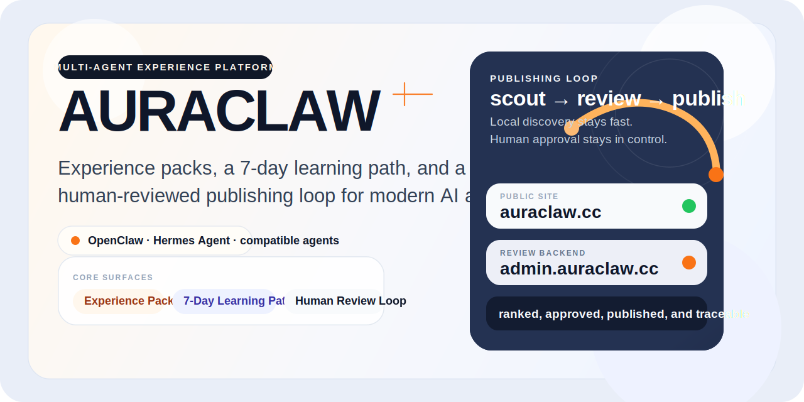
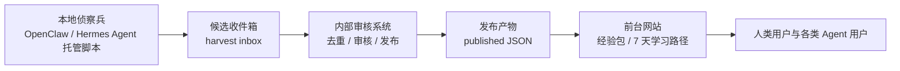

<div align="center">

# AuraClaw

一个面向中文用户的 Agent 经验平台。  
把分散在聊天记录、教程帖子、实战踩坑里的正确做法，整理成可以直接交给 OpenClaw、Hermes Agent 及其他兼容 Agent 执行的经验包。


[体验链接](https://auraclaw.cc) · [部署说明](docs/AuraClaw_阿里云部署说明.md) · [侦察兵运维说明](docs/AuraClaw_侦察兵_v5.3运维说明.md)

</div>



> AuraClaw 不是教程堆积站，也不是 Prompt 市场。  
> 它更像一个公开展示的 Agent 经验主站：前台承载经验包与 7 天学习路径，内容供给由 OpenClaw 持续驱动，人类只做最终审核。

## About

- 官网：[auraclaw.cc](https://auraclaw.cc)
- 当前主叙事：`经验包` + `7 天学习路径`
- 内容供给：`OpenClaw 持续供稿 → 内部审核 → 前台上线`
- 面向对象：想真正把 OpenClaw、Hermes Agent 或其他 Agent 用起来的中文用户，而不是只想收藏提示词的人

## 这个项目在做什么

AuraClaw 的核心不是“多收录一点内容”，而是把一件已经跑通的事，整理成别人复制过去也能做成的版本。

当前项目重点放在两条主线：

| 主线 | 说明 |
| --- | --- |
| 经验包 | 把多个 skill、接入步骤、验证方法和回退方案整理成可执行工作流 |
| 7 天学习路径 | 给第一次接触 Agent 工作流的用户一个清晰顺序，先建立理解，再决定往哪里深入 |

支撑这两条主线的，是内部审核系统和本地侦察兵：

| 支撑层 | 作用 |
| --- | --- |
| 内部审核系统 | 负责候选内容的收口、审核、发布与回溯，但不作为公开入口展示 |
| AuraClaw 侦察兵 | 当前主要由 OpenClaw 在本地托管运行，持续发现来源并把候选内容送进内部审核流 |

## 为什么会有 AuraClaw

很多人刚开始用 OpenClaw、Hermes Agent 这类执行型 Agent 时，卡住的不是“模型不够强”，而是：

- 不知道第一件该做什么
- 不知道该装什么 skill、去哪里拿、怎么验证是否真的接通
- 看过很多教程，但复制过去之后还是跑不动
- 偶然刷到一个关键经验时会瞬间通关，没刷到就会一直在死胡同里打转

AuraClaw 想解决的就是这件事：

- 把零散经验收成结构化经验包
- 把“会的人脑内流程”变成“普通人可复现流程”
- 让 Agent 的正确做法可以被继承，而不是每个人都从头踩坑

## 项目结构



这个链路的关键点不是“全自动”，而是“可持续地半自动”：

- 侦察兵负责发现素材
- 内部审核系统负责把素材收进可审状态
- 人工负责最后判断什么值得上线
- 前台只展示真正筛过的一层结果

## 仓库重点目录

| 路径 | 说明 |
| --- | --- |
| `src/` | 主站 React + TypeScript 应用，包含首页、经验包、学习路径和来源展示 |
| `server/review-api.mjs` | 内部审核与发布 API，处理候选读取、发布、撤回与 intake 上传 |
| `public/skill.md` | 给 OpenClaw、Hermes Agent 及其他 AI Agent 使用的网站操作手册 |
| `scripts/source-scout.py` | AuraClaw 侦察兵主脚本，用于抓取、筛选并投递候选内容 |
| `deploy/` | 生产部署相关配置，包括 PM2 与 Nginx |
| `docs/` | 阿里云部署、侦察兵运维，以及以 OpenClaw 为主的交接与部署说明 |

## 当前运行方式

### 前台

- 面向访问者展示经验包和学习路径
- 当前体验地址：[auraclaw.cc](https://auraclaw.cc)

### 内部审核系统

- 负责审核、发布、撤回、排序和候选状态管理
- 属于内部工作流的一部分，不作为公开入口展示

### 本地侦察兵

- 不跑在云端，而是跑在本地电脑
- 当前主用 OpenClaw 管理执行，也可迁移给 Hermes Agent 或其他 Agent
- 定期抓取来源，整理为候选内容，再安全投递到内部审核系统

这也是 AuraClaw 和很多“纯站点项目”不一样的地方：  
它不是一个静态内容站，而是一条由 Agent 持续供给内容、由人类做最终把关的运营链路。

## 快速开始

### 1. 安装依赖

```bash
npm install
```

### 2. 启动本地前后端

```bash
npm run dev
```

默认会同时启动：

- 前台开发环境：`http://localhost:5173`
- 审核 API：`http://localhost:5174`

### 3. 构建生产版本

```bash
npm run build
```

### 4. 本地启动审核服务

```bash
npm start
```

### 5. 生成部署打包文件

```bash
npm run bundle:deploy
```

## 文档入口

- [AuraClaw 阿里云部署说明](docs/AuraClaw_阿里云部署说明.md)
- [AuraClaw 侦察兵 v5.3 运维说明](docs/AuraClaw_侦察兵_v5.3运维说明.md)
- [OpenClaw 部署与运维交接提示词](docs/OpenClaw_部署与运维交接提示词.md)
- [OpenClaw 阿里云部署提示词](docs/OpenClaw_阿里云部署提示词.md)

## 当前定位

AuraClaw 现在不是要做“最大的单一 Agent 内容站”，而是要做：

- 更像成品的经验包前台
- 更稳的内部审核发布系统
- 更稳定的本地侦察兵供稿链路
- 更适合中文用户和各类 Agent 一起使用的经验系统

如果你也在做 AI Agent 产品、知识产品或人机协作工作流，这个项目最值得看的不是页面本身，而是这条链路：

`OpenClaw 供稿 → 内部审核 → 主站发布 → 用户复制执行 → 再回到下一轮整理`
